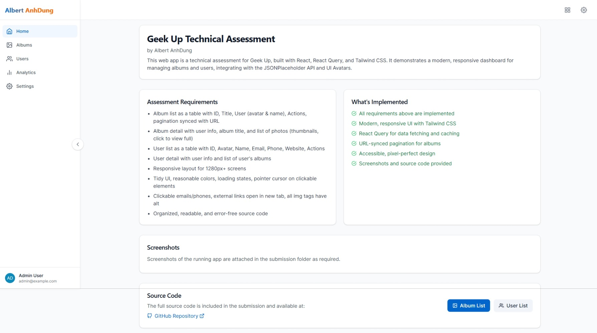
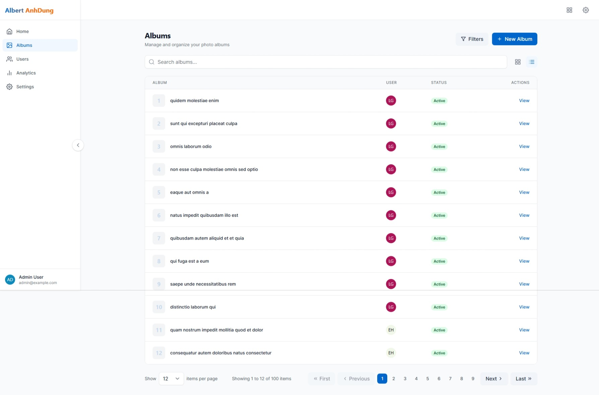
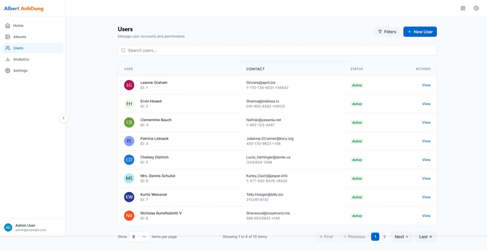

# GeekUp Web App

A modern web application built with React, TypeScript, and Vite, designed for managing and organizing tech events and meetups.

## Preview

### Web Platform

| Home | Albums (Grid) | Albums (List) | Album Details | Photo Preview | User List | User Details |
|------|---------------|---------------|--------------|---------------|-----------|-------------|
|  |  |  |  |  |  |  |

### Mobile App Platform

| Home | Albums (Grid) | Albums (List) | Album Details | Search User | User List | User Details |
|------|---------------|---------------|--------------|-------------|-----------|-------------|
|  |  |  |  |  |  |  |

## Prerequisites

Before you begin, ensure you have the following installed:
- [Node.js](https://nodejs.org/) (v18.0.0 or higher)
- [Git](https://git-scm.com/)
- [VS Code](https://code.visualstudio.com/) (recommended)
- [GitHub CLI](https://cli.github.com/) (optional, for easier GitHub integration)

## Environment Setup

1. **Install Node.js**
   - Download and install from [Node.js official website](https://nodejs.org/)
   - Verify installation:
     ```bash
     node --version
     npm --version
     ```

2. **Configure Git**
   ```bash
   git config --global user.name "Your Name"
   git config --global user.email "your.email@example.com"
   ```

## Project Setup

### 1. Clone the Repository

```bash
git clone https://github.com/your-username/geekup-web-app.git
cd web-app
```

### 2. Install Dependencies

```bash
# Install all dependencies
npm install

# If you encounter any issues, try clearing npm cache
npm cache clean --force
```

### 3. Environment Variables

Create a `.env` file in the root directory:

```bash
cp .env
```

Required environment variables:
```
VITE_API_URL=your_api_url
VITE_APP_ENV=development
```

### 4. Start Development Server

```bash
# Start the development server
npm run dev

# The application will be available at:
# http://localhost:5173
```

### 5. Build for Production

```bash
# Create production build
npm run build

# Preview production build locally
npm run preview
```

## Available Scripts

- `npm run dev` - Start development server with hot reload
- `npm run build` - Create production build
- `npm run preview` - Preview production build locally
- `npm run lint` - Run ESLint to check code quality
- `npm run type-check` - Run TypeScript type checking
- `npm run test` - Run unit tests
- `npm run test:coverage` - Run tests with coverage report
- `npm run format` - Format code with Prettier
<!-- 
## Development Guidelines

1. **Code Style**
   - Follow the ESLint and Prettier configurations
   - Use TypeScript for all new files
   - Write meaningful commit messages

2. **Git Workflow**
   ```bash
   # Create a new branch
   git checkout -b feature/your-feature-name

   # After making changes
   git add .
   git commit -m "feat: your feature description"
   git push origin feature/your-feature-name
   ```

3. **Testing**
   - Write tests for new features
   - Maintain test coverage above 80%
   - Run tests before committing -->

## Troubleshooting

1. **Node Modules Issues**
   ```bash
   # Remove node_modules and reinstall
   rm -rf node_modules
   npm install
   ```

2. **Port Already in Use**
   ```bash
   # Kill process using port 5173
   npx kill-port 5173
   ```

3. **TypeScript Errors**
   ```bash
   # Clear TypeScript cache
   rm -rf node_modules/.cache/typescript
   ```

## Support

For any issues or questions:
1. Check the [documentation](docs/)
2. Open an issue on GitHub
3. Contact the development team

## License

This project is licensed under the MIT License - see the [LICENSE](LICENSE) file for details.
<!-- 
# React + TypeScript + Vite

This template provides a minimal setup to get React working in Vite with HMR and some ESLint rules.

Currently, two official plugins are available:

- [@vitejs/plugin-react](https://github.com/vitejs/vite-plugin-react/blob/main/packages/plugin-react) uses [Babel](https://babeljs.io/) for Fast Refresh
- [@vitejs/plugin-react-swc](https://github.com/vitejs/vite-plugin-react/blob/main/packages/plugin-react-swc) uses [SWC](https://swc.rs/) for Fast Refresh

## Expanding the ESLint configuration

If you are developing a production application, we recommend updating the configuration to enable type-aware lint rules:

```js
export default tseslint.config({
  extends: [
    // Remove ...tseslint.configs.recommended and replace with this
    ...tseslint.configs.recommendedTypeChecked,
    // Alternatively, use this for stricter rules
    ...tseslint.configs.strictTypeChecked,
    // Optionally, add this for stylistic rules
    ...tseslint.configs.stylisticTypeChecked,
  ],
  languageOptions: {
    // other options...
    parserOptions: {
      project: ['./tsconfig.node.json', './tsconfig.app.json'],
      tsconfigRootDir: import.meta.dirname,
    },
  },
})
```

You can also install [eslint-plugin-react-x](https://github.com/Rel1cx/eslint-react/tree/main/packages/plugins/eslint-plugin-react-x) and [eslint-plugin-react-dom](https://github.com/Rel1cx/eslint-react/tree/main/packages/plugins/eslint-plugin-react-dom) for React-specific lint rules:

```js
// eslint.config.js
import reactX from 'eslint-plugin-react-x'
import reactDom from 'eslint-plugin-react-dom'

export default tseslint.config({
  plugins: {
    // Add the react-x and react-dom plugins
    'react-x': reactX,
    'react-dom': reactDom,
  },
  rules: {
    // other rules...
    // Enable its recommended typescript rules
    ...reactX.configs['recommended-typescript'].rules,
    ...reactDom.configs.recommended.rules,
  },
})
``` -->
