# GeekUp Web App

A modern web application built with React, TypeScript, and Vite, designed for managing and organizing tech events and meetups.

## For Recruiters

> **Note:** A detailed explanation of my development approach, including the libraries and tools used and the reasoning behind these choices, can be found in [APPROACH.md](APPROACH.md). This document provides insights into the technical decisions made during development and demonstrates my problem-solving methodology.

## Preview

### Web Platform

| Home | Albums (Grid) | Albums (List) | Album Details | Photo Preview | User List | User Details |
|------|---------------|---------------|--------------|---------------|-----------|-------------|
|  | 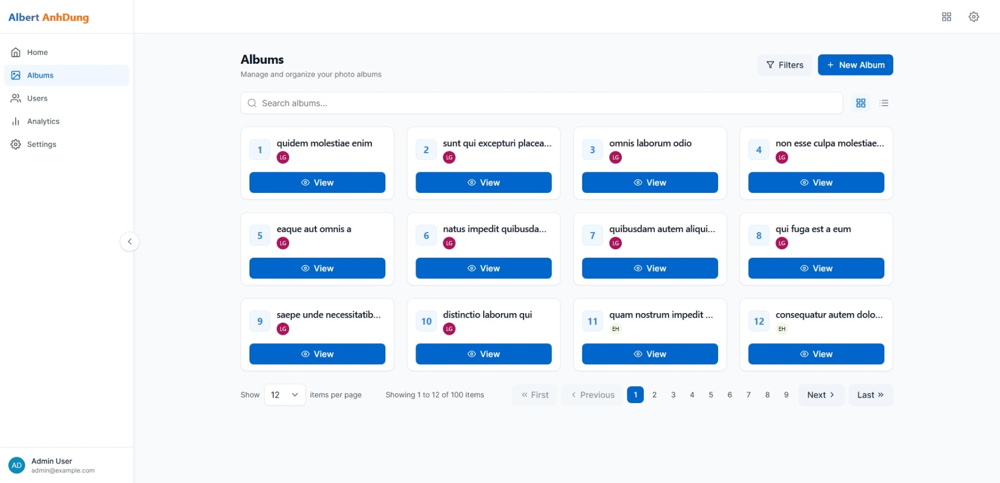 | 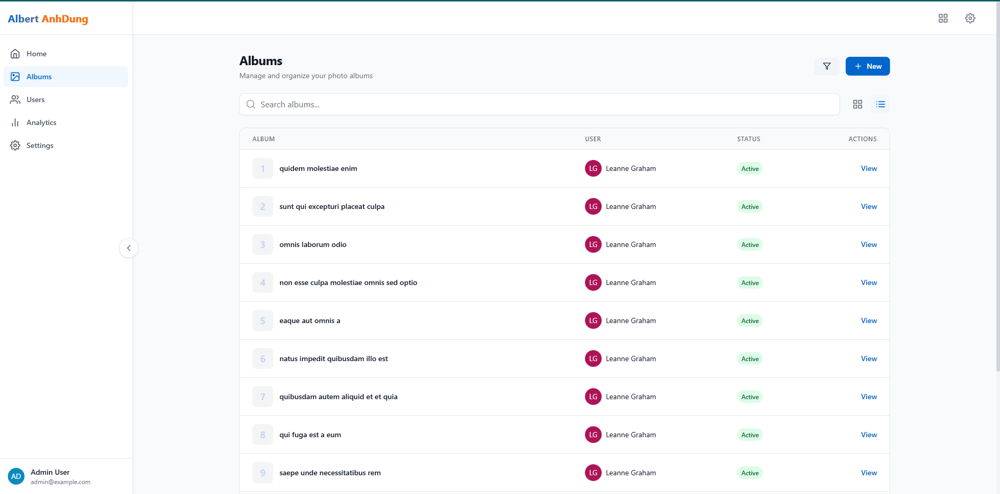 | 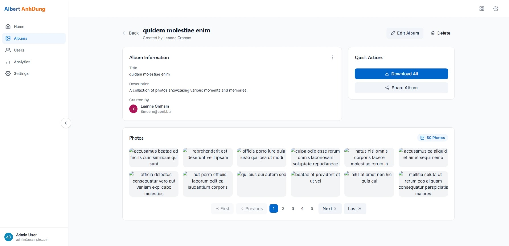 | 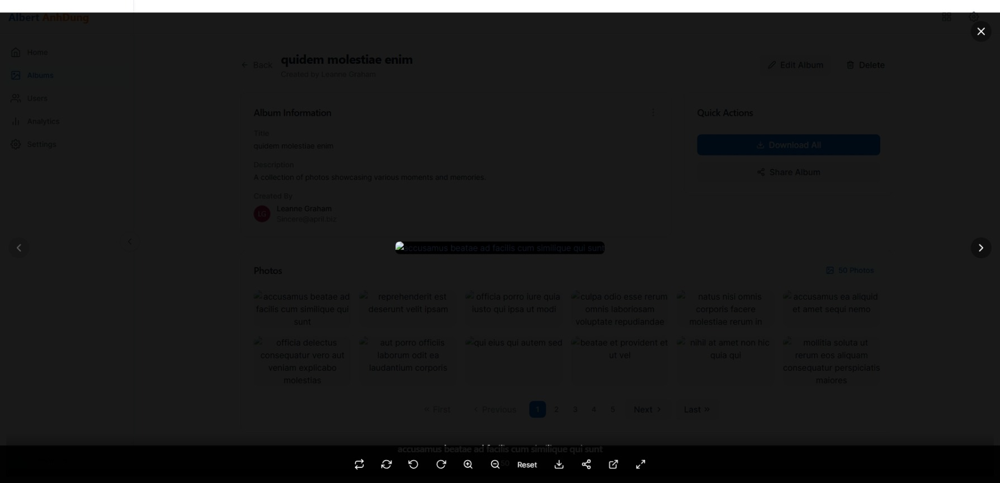 | 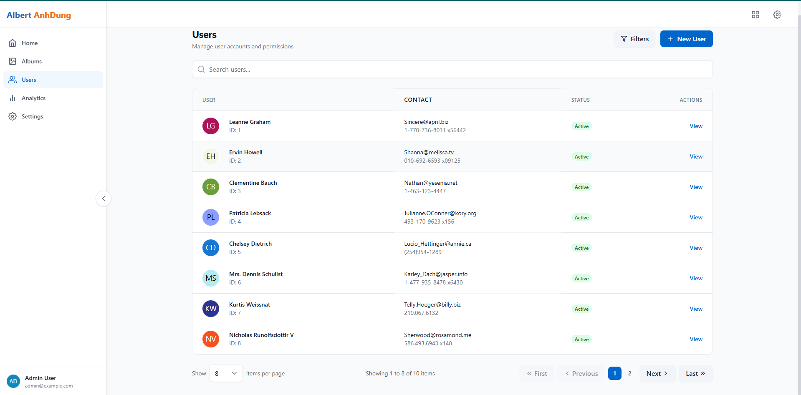 | 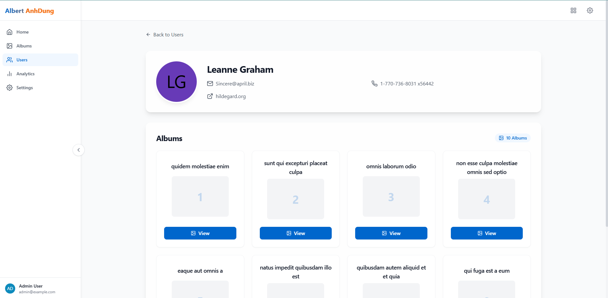 |

### Mobile App Platform

| Home | Albums (Grid) | Albums (List) | Album Details | Search User | User List | User Details |
|------|---------------|---------------|--------------|-------------|-----------|-------------|
| 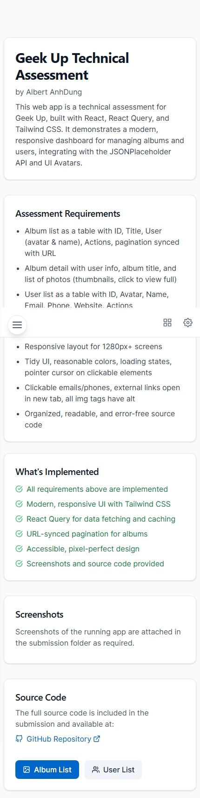 | 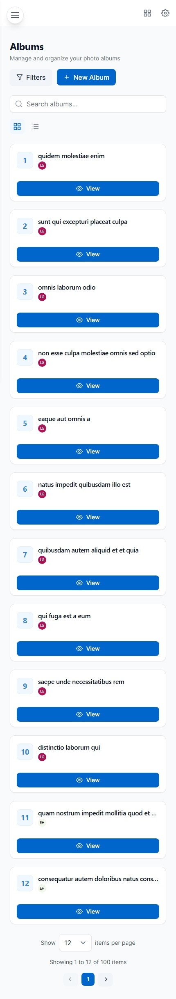 | 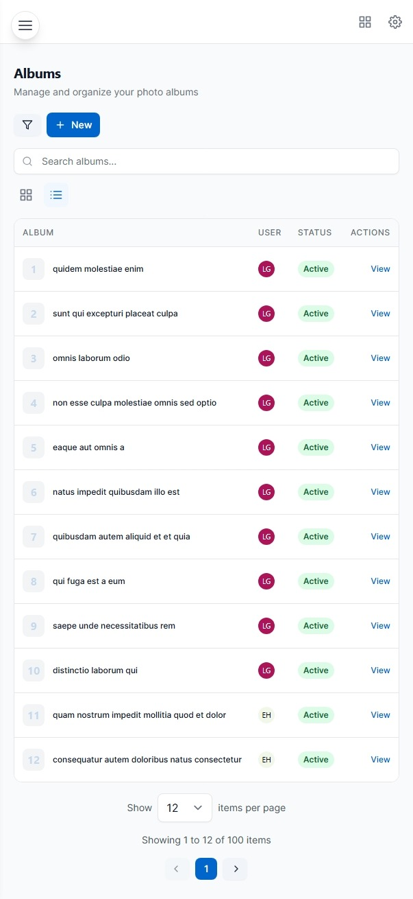 | 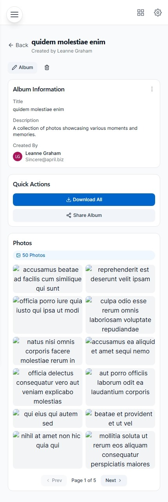 | 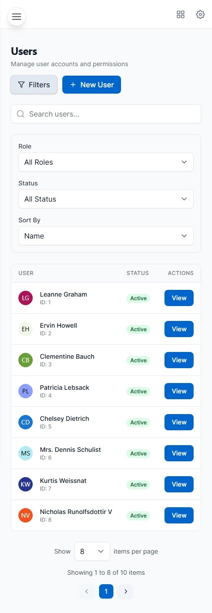 | 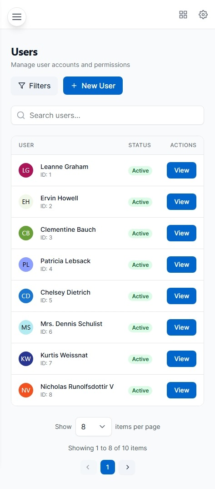 | 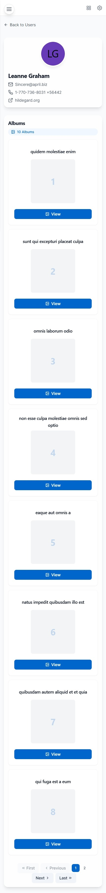 |

## Key Features

- 🎨 Modern, responsive UI with Tailwind CSS
- 🔄 Real-time data fetching with React Query
- 📱 Mobile-first design approach
- 🎯 Type-safe development with TypeScript
- ⚡ Fast development with Vite
- 🔍 Advanced search and filtering capabilities
- 📸 Interactive photo viewer with zoom and rotation
- 📊 Efficient state management
- 🎭 Smooth animations and transitions

## Prerequisites

Before you begin, ensure you have the following installed:
- [Node.js](https://nodejs.org/) (v18.0.0 or higher)
- [Git](https://git-scm.com/)
- [VS Code](https://code.visualstudio.com/) (recommended)
- [GitHub CLI](https://cli.github.com/) (optional, for easier GitHub integration)

## Environment Setup

1. **Install Node.js**
   - Download and install from [Node.js official website](https://nodejs.org/)
   - Verify installation:
     ```bash
     node --version
     npm --version
     ```

2. **Configure Git**
   ```bash
   git config --global user.name "Your Name"
   git config --global user.email "your.email@example.com"
   ```

## Project Setup

### 1. Clone the Repository

```bash
git clone https://github.com/your-username/geekup-web-app.git
cd web-app
```

### 2. Install Dependencies

```bash
# Install all dependencies
npm install

# If you encounter any issues, try clearing npm cache
npm cache clean --force
```

### 3. Environment Variables

Create a `.env` file in the root directory:

```bash
cp .env
```

Required environment variables:
```
VITE_API_URL=your_api_url
VITE_APP_ENV=development
```

### 4. Start Development Server

```bash
# Start the development server
npm run dev

# The application will be available at:
# http://localhost:5173
```

### 5. Build for Production

```bash
# Create production build
npm run build

# Preview production build locally
npm run preview
```

## Available Scripts

- `npm run dev` - Start development server with hot reload
- `npm run build` - Create production build
- `npm run preview` - Preview production build locally
- `npm run lint` - Run ESLint to check code quality
- `npm run type-check` - Run TypeScript type checking
- `npm run test` - Run unit tests
- `npm run test:coverage` - Run tests with coverage report
- `npm run format` - Format code with Prettier

## Troubleshooting

1. **Node Modules Issues**
   ```bash
   # Remove node_modules and reinstall
   rm -rf node_modules
   npm install
   ```

2. **Port Already in Use**
   ```bash
   # Kill process using port 5173
   npx kill-port 5173
   ```

3. **TypeScript Errors**
   ```bash
   # Clear TypeScript cache
   rm -rf node_modules/.cache/typescript
   ```

## Support

For any issues or questions:
1. Check the [documentation](docs/)
2. Open an issue on GitHub
3. Contact the development team

## License

This project is licensed under the MIT License - see the [LICENSE](LICENSE) file for details.
